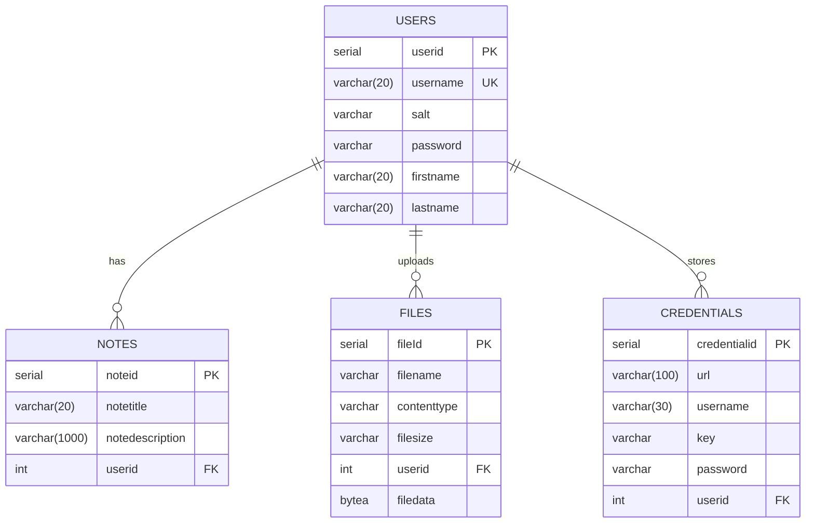

# SuperDrive Cloud Storage

A secure cloud storage application built with Spring Boot that allows users to store files, notes, and credentials. This
project demonstrates my ability to create full-stack web applications with a focus on security and testing.

## 🚀 Features

### 1. Secure File Storage

- Upload and download files
- Automatic file encryption
- File size validation (max 1MB per file)
- Support for multiple file types

### 2. Note Management

- Create, read, update, and delete notes
- Rich text support
- Real-time updates
- Input validation and sanitization

### 3. Credential Management

- Securely store website credentials
- Automatic password encryption/decryption
- URL and username management
- Secure viewing of stored passwords

### 4. Security Features

- User authentication and authorization
- Password hashing using industry-standard algorithms
- CSRF protection
- XSS prevention
- Secure session management

## 🛠️ Technology Stack

### Backend

- **Framework**: Spring Boot 3.x
- **Security**: Spring Security
- **Database**: PostgreSQL
- **ORM**: MyBatis
- **Build Tool**: Maven

### Frontend

- **Template Engine**: Thymeleaf
- **CSS Framework**: Bootstrap
- **JavaScript**: jQuery

### Testing

- **Integration Testing**: Spring Boot Test
- **UI Testing**: Selenium WebDriver

## 🏗️ Architecture

The application follows a layered architecture:

1. **Presentation Layer**: Controllers and Views
2. **Business Layer**: Services and DTOs
3. **Data Layer**: Repositories and Entities

### Key Components

- `HomeController`: Main controller for handling user requests
- `SecurityConfig`: Security configuration and password encryption
- `UserService`: User management and authentication
- `FileService`: File handling and storage
- `NoteService`: Note CRUD operations
- `CredentialService`: Credential management with encryption

## 📊 Database Schema



### Data Relationships

- One-to-Many relationship between Users and Notes
- One-to-Many relationship between Users and Files
- One-to-Many relationship between Users and Credentials
- Cascading deletes ensure referential integrity

## 🔒 Security Implementation

1. **Authentication**
    - Custom user authentication
    - Session management
    - Remember-me functionality

2. **Password Security**
    - Bcrypt password hashing
    - Salt generation
    - Secure password storage

3. **Data Protection**
    - AES encryption for sensitive data
    - Secure key management
    - Data access control

## 🧪 Testing Strategy

### End-to-End Tests

- Selenium tests for user flows
- File upload/download testing
- Note and credential management testing

## 🔄 Error Handling

- Global exception handling
- Custom error pages
- User-friendly error messages
- Logging and monitoring

## 🌱 Getting Started

1. Clone the repository:
   ```bash
   git clone https://github.com/yourusername/superdrive.git
   ```

2. Navigate to the project directory:
   ```bash
   cd superdrive
   ```

3. Configure the database:
   - Open `src/main/resources/application.properties`
   - Update the following properties with your PostgreSQL database details:
     ```properties
     # Database Configuration
     spring.datasource.url=jdbc:postgresql://localhost:5432/superdrive
     spring.datasource.username=your_username
     spring.datasource.password=your_password
     ```
   - Make sure PostgreSQL is installed and running
   - Create a database named 'superdrive':
     ```sql
     CREATE DATABASE superdrive;
     ```

4. Build the project:
   ```bash
   mvn clean install
   ```

5. Run the application:
   ```bash
   mvn spring-boot:run
   ```

6. Access the application:
   ```
   http://localhost:8080
   ```

The application will automatically create all necessary tables on first run using schema.sql.

## 💡 Future Enhancements

1. **File Management**
    - Multiple file upload
    - Directory structure
    - File sharing capabilities

2. **User Experience**
    - Drag-and-drop file upload
    - Rich text editor for notes
    - Password strength indicator

3. **Security**
    - Two-factor authentication
    - OAuth integration
    - Enhanced audit logging


